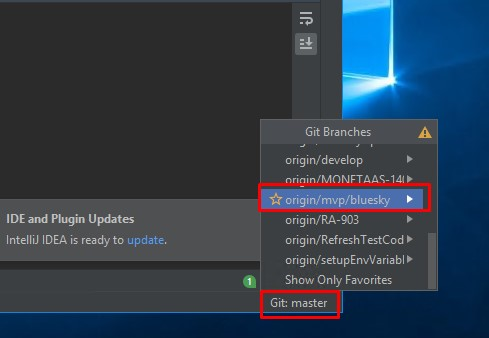
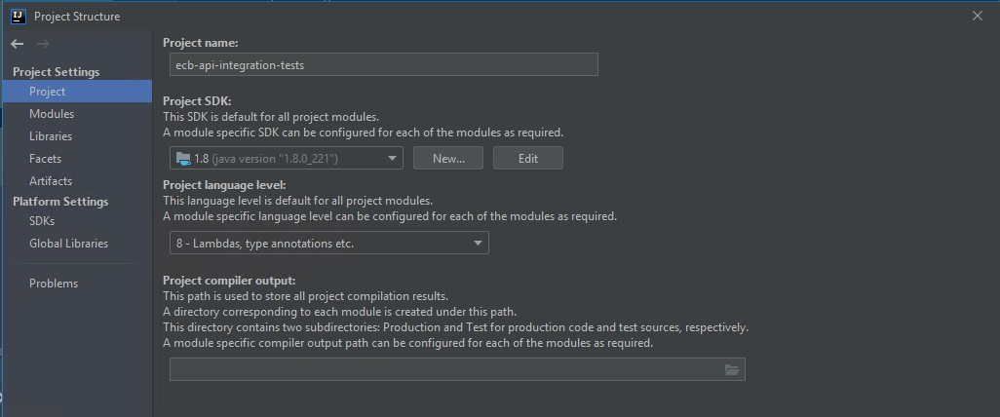
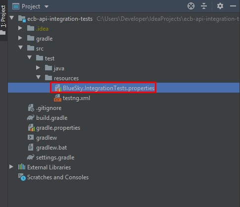
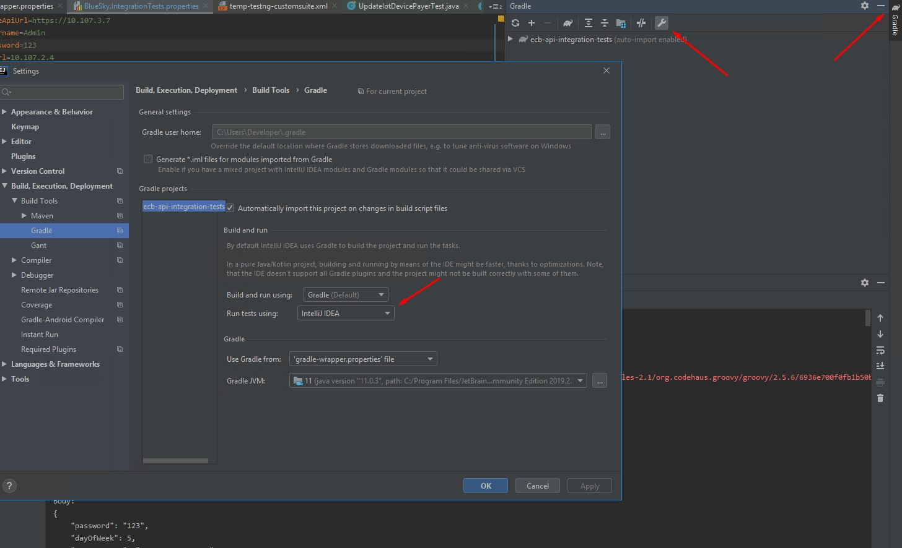
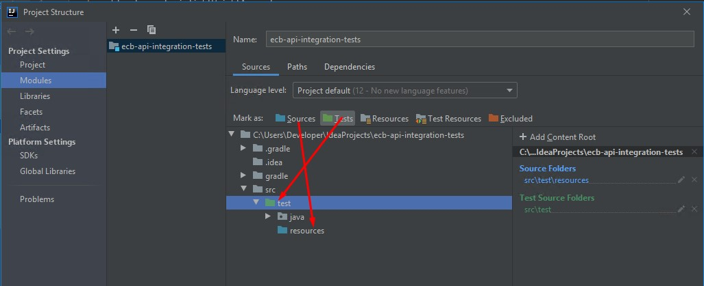
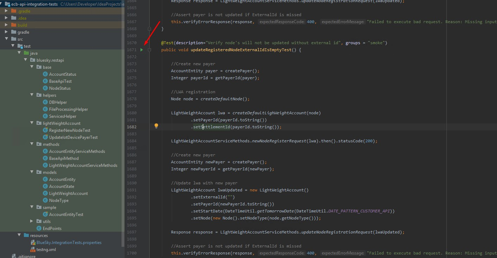

# BlueSky integration tests running guide.


## How to run the tests from the IDE (Intellij IDEA)
1.	Open Azure machine.
2.	Download and install Git.
3.	Download and install jdk 8. (Run in powershell: choco install jdk8 -params "both=true")
4.	Download and install Intellij IDEA.
5.	Open Intellij IDEA.
6.	Create a project from Version Control.
7.	Clone project from git@git.rosetta.ericssondevops.com:sa-bss-ecb/ecb/ecb-api-integration-tests.git
8.	In Terminal -> Git checkout to mvp/bluesky branch (or any branch you need) <br>

    

9.	Open File->Project Structure. Set the following parameters: <br>

    
 
10.	Wait while a project is indexing.
11.	Update gradle.properties file with correct jdk path: <br>

    `org.gradle.java.home=C:\\Program Files\\Java\\jdk1.8.0_221`
 
12.	Update BlueSky.IntegrationTests.properties file with the correct parameters. See the example below <br>

    

```
baseApiUrl=https://127.0.0.1
username=Admin
password=123
dbUrl=127.0.0.1
dbAdmin=nmdbo
dbPassword=MetraTech1
``` 

13.	In build tab run “Upgrade Gradle wrapper to 4.8.1 version and re-import the project”
14.	Open Gradle Settings. 
15.	Set Run tests using: Intellij IDE <br>

    
 
16.	Open File->Project Structure and set folders <br>

    
 
17.	Open build.gradle and apply suggestion and wait until download all files 
18.	Make sure API services is started.
19.	The tests are under lightWeightAccount package
20.	Select needed API method.
21.	Run tests from IDE <br>

    
 
22.	Check the console. (Warning should be skipped, will be deleted in future)
23.	Download from https://agile.ecb.ericssondevops.com/browse/QA-297 account hierarchy (corp_dep_acc_template_20191008.xml) and bat file (AddAccountHierarchy.bat)
24.	Copy attachment files to C:\MetraTech\RMP\Bin  and run AddAccountHierarchy.bat for import hierarchy accounts to DB


## How to run the tests from the CLI
1.	Open Azure machine.
2.	Download and install jdk 8. (Run in powershell: choco install jdk8 -params "both=true")
3.	Install GIT
4.	Add git as environment variable.
5.	Create new directory  C:\{NewDirectory} 
6.	In CMD go to  C:\{NewDirectory} 
7.	Perform `git clone -b mvp/bluesky  git@git.rosetta.ericssondevops.com:sa-bss-ecb/ecb/ecb-api-integration-tests.git` or any branch you need.
8.  Update gradle.properties file with correct jdk path: <br>

    `org.gradle.java.home=C:\\Program Files\\Java\\jdk1.8.0_221`

9.	Open file: 
ecb-api-integration-tests\src\test\resources\BlueSky.IntegrationTests.properties
Update file with the correct parameters. See the example below :
```
baseApiUrl=https://10.107.3.7
username=Admin
password=123
dbUrl=10.107.2.4
dbAdmin=nmdbo
dbPassword=MetraTech1
```

10.	Make sure ECB-API services is started.
11.	Download from https://agile.ecb.ericssondevops.com/browse/QA-297 account hierarchy (corp_dep_acc_template_20191008.xml) and bat file (AddAccountHierarchy.bat)
12.	Copy attachment files to C:\MetraTech\RMP\Bin  and run AddAccountHierarchy.bat for import hierarchy accounts to DB
13.	In CMD go to folder C:\{NewDirectory}\ecb-api-integration-tests
14.	Run command `gradlew build`
15.	Check the console (Warning should be skipped, will be deleted in future)
16.	After build job is finish. Run command `gradlew allureReport` to generate report
17.	Run `gradlew allureServe` to open report in default browser.

